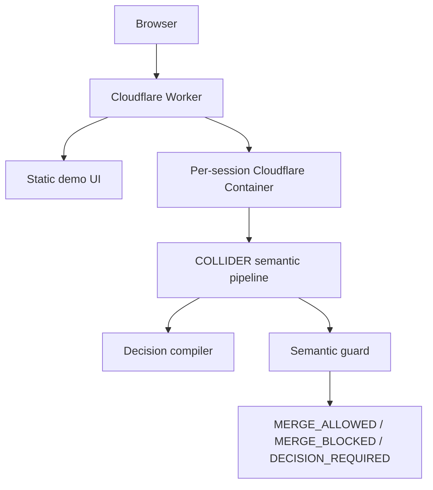

  

<h1 align="center">COLLIDER</h1>

<strong>Semantic CI for agentic software development.</strong>

Find the decision the specification forgot to make.

  <a href="https://collider-semantic-ci.faadil-casecraft.workers.dev/"><strong>Live Demo</strong></a>
  ·
  <a href="https://scrimba.com/explain/guide0tftf2fa4?claim=3geifapic08ivlp9&fullscreen=1"><strong>Final Walkthrough</strong></a>
  ·
  <a href="evidence/bob-sessions/LIVE-BOB-2026-09-27-01.md"><strong>Bob Proof</strong></a>
  ·
  <a href="evidence/runtime/PUBLIC-THREE-VERDICT-GUARD-2026-09-27.md"><strong>Runtime Evidence</strong></a>

IBM Bob 2 Hackathon · Cloudflare Worker + per-session Container

## The problem

Parallel coding agents can all pass their local tests while making incompatible assumptions across service boundaries.

A conventional CI pipeline sees green tests. COLLIDER asks a different question:

> **Did the specification actually decide the meaning the agents implemented?**

The canonical fixture starts with:

- **30 local tests passing**
- **3/3 workstreams green**
- **2 integration conflicts**

One conflict is ordinary agent drift. The other exists because the specification never chose a customer identity.

## How COLLIDER works

1. **Detect disagreement.** Independent workstreams expose the assumptions they implemented.
2. **Classify the cause.** Source-explicit contradictions become AGENT_DRIFT; source-silent disagreements become SPEC_GAP / UNKNOWN.
3. **Ask only where authority ends.** COLLIDER does not convert consensus into truth and does not force a decision.
4. **Compile the decision.** A human choice becomes a specification patch, targeted repair, regression contract and decision memory.
5. **Guard future changes.** Later changes are judged against source authority and remembered decisions.

    PROBE → COLLIDE → ADJUDICATE → DECIDE
          → COMPILE → PATCH → VERIFY → REMEMBER → GUARD

## The signature proof

The failed-payment fixture contains two superficially similar mismatches with different causes:

| Conflict | Source authority | COLLIDER result |
|---|---|---|
| refund_amount vs credit_amount | The source explicitly says refund_amount | AGENT_DRIFT → repair from evidence |
| email vs account_id | The source never chooses customer identity | SPEC_GAP / UNKNOWN → human decision required |

Selecting account_id moves the executable integration state from:

    2 conflicts / INTEGRATION_BLOCKED
    →
    0 conflicts / SEMANTICALLY_READY

The decision is then stored as executable memory.

## Semantic CI adds a third verdict

After the decision is remembered, COLLIDER tests controlled future changes:

| Future change | Conventional tests | Semantic CI |
|---|---:|---|
| API reverts account_id → email | 33 pass / 4 fail | MERGE_BLOCKED |
| Notification wording only | 37/37 pass | MERGE_ALLOWED |
| Ledger changes cents → dollars | **37/37 pass** | **DECISION_REQUIRED** |

That final row is the core product claim: **ordinary tests can all pass while the meaning is still undecided.**

For the identity revert, removing decision memory changes the verdict from MERGE_BLOCKED to DECISION_REQUIRED. Memory changes the result rather than merely storing text.

## UNKNOWN is a valid outcome

COLLIDER does not force specification decisions.

Choosing KEEP UNKNOWN:

- writes no canon;
- writes no decision memory;
- applies no repair;
- leaves the gate at DECISION_REQUIRED.

Correct abstention is product behavior.

## IBM Bob integration

IBM Bob was used directly in the repository and is also a project-native COLLIDER surface.

The repo ships:

- a COLLIDER Bob custom mode in .bob/custom_modes.yaml;
- a reusable semantic-review skill;
- provenance and truth-boundary rules;
- a project-level MCP server exposing semantic gate, PR gate, decision memory, live-Bob validation, rule export and replay evaluation;
- lifecycle hooks for session context and receipts.

A real Bob run used **three isolated Bob subagents** to reproduce the source-silent customer_identity ambiguity.

Fresh replay evidence is preserved honestly:

- **Attempt 01:** converged on account_id but failed the withheld compatibility contract, **5/7**;
- **Attempt 02:** a new isolated targeted-repair replay preserved the public interface and passed **7/7**, producing REPLAY_PASS.

The public demo’s comparative interpretation objects remain **PRESEEDED**. They are never relabeled as live Bob output.

Evidence: [LIVE_BOB run](evidence/bob-sessions/LIVE-BOB-2026-09-27-01.md) · [Attempt 01](evidence/bob-sessions/FRESH-REPLAY-ATTEMPT-01-2026-09-27.md) · [Attempt 02](evidence/bob-sessions/FRESH-REPLAY-ATTEMPT-02-2026-09-27.md).

## Architecture

The public runtime uses one isolated container per browser session. Guard probes restore the previous verified workspace after each controlled change.

## Try it

**Live:** [collider-semantic-ci.faadil-casecraft.workers.dev](https://collider-semantic-ci.faadil-casecraft.workers.dev/)

**Walkthrough:** [COLLIDER final walkthrough](https://scrimba.com/explain/guide0tftf2fa4?claim=3geifapic08ivlp9&fullscreen=1)

**Local:**

    python3 demo-ui/server.py
    # open http://127.0.0.1:4173

Core verification:

    python3 -m pytest -q -p no:cacheprovider
    npx tsc --noEmit

Last recorded full verification:

    271 passed
    123 subtests passed
    TypeScript: clean

## Public evidence

- [Three-verdict public guard](evidence/runtime/PUBLIC-THREE-VERDICT-GUARD-2026-09-27.md)
- [GitHub PR Semantic CI proof](evidence/runtime/GITHUB-SEMANTIC-CI-THREE-VERDICT-2026-09-27.md)
- [Public session isolation](evidence/runtime/PUBLIC-SESSION-ISOLATION-2026-09-27.md)
- [Mobile provenance](evidence/runtime/PUBLIC-MOBILE-PROVENANCE-2026-09-27.md)
- [Runtime / commit binding](evidence/runtime/RUNTIME-COMMIT-BINDING-2026-09-27.md)
- [LIVE_BOB run](evidence/bob-sessions/LIVE-BOB-2026-09-27-01.md)
- [Fresh replay Attempt 02](evidence/bob-sessions/FRESH-REPLAY-ATTEMPT-02-2026-09-27.md)

## Repository

- collider/ — semantic gate, compiler, replay and guard logic
- api/, ledger/, notifications/ — failed-payment workstreams
- fixtures/ — canonical specification fixture
- demo-ui/ — interactive product surface
- evidence/ — reproducible runtime and Bob proof
- .bob/ — native IBM Bob integration
- tests/ — regression, integrity and deployment tests
- cloudflare/, src/ — hosted runtime adapter

## Truth boundary

COLLIDER distinguishes source evidence, agent inference and human decisions.

    SOURCE EXPLICIT + AGENT DISAGREES
    → AGENT_DRIFT

    SOURCE SILENT + AGENTS DISAGREE
    → SPEC_GAP / UNKNOWN

    SOURCE SILENT + AGENTS AGREE
    → SHARED ASSUMPTION / INFERRED

Consensus does not create authority.

---

**Real failure > fake success.**

MIT licensed.
